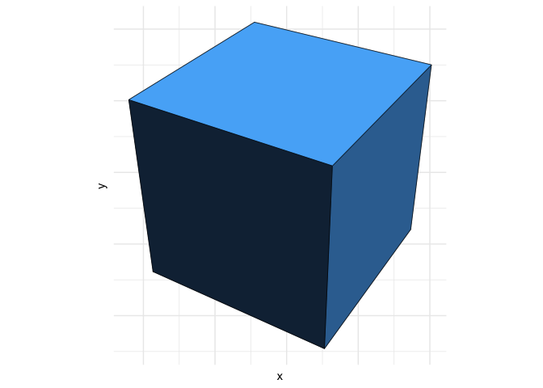

<!-- README.md is generated from README.Rmd. Please edit that file -->

# threed - 3d object transformation library

 [](https://travis-ci.org/coolbutuseless/threed)
[](https://codecov.io/github/coolbutuseless/threed?branch=master)
[](https://ci.appveyor.com/project/coolbutuseless/threed)

`threed` is a small, dependency-free R library for doing 3d object
transformations i.e. translation, scaling, rotation and perspective
projection.

The only 3d object format currently supported is the `mesh3d` format
from `rgl` (as well as some extensions to the `mesh3d` format to support
point and line objects).

#### Features:

  - standard translate, scale and rotate transformations
  - perspective + orthographic projection
  - `as.data.frame.mesh3d`
      - convert 3d objects into data.frames
      - calculates a lot of meta data such as face normals, vertex
        normals and whether a face is hidden from view.
  - `fortify.mesh3d`
      - this enables a `mesh3d` object to be given as the ggplot2 `data`
        argument.
  - Includes some built-in `mesh3d` objects (see `threed::mesh3dobj`)
    e.g.
      - `cube`, `icosahedron`, `teapot`, `cow`, `bunny`

#### Vignettes

  - `vignette('drawing-a-cube', package='threed')`
      - All the ways of drawing a 3d cube using `threed` in `ggplot2`
      - e.g. hidden line removal, fake light shading etc
  - `vignette('mesh3d', package='threed')`
      - Adaptations and extensions to the `mesh3d` format
  - `vignette('animate-in-3d', package='threed')`
      - Creating a simple 3d animated object in `ggplot2`

#### Rendering objects

  - `threed` is just a 3d object transformation package and does not
    include any facility for rendering of objects.
  - Examples are included below showing how to convert 3d objects to a
    data.frame and then render with:
      - `ggplot2` and `geom_polygon()`
      - Base R plotting with `polygon()`


## Installation

``` r
# install.packages("devtools")
devtools::install_github("coolbutuseless/threed")
```

## `as.data.frame.mesh3d()`

A `mesh3d` object can be converted to a data.frame representation using
`threed::as.data.frame.mesh3d()`.

Besides the standard `x,y,z` coordinates, the data.frame also includes:

  - `element_id` identifier for each element
  - `element_type` indicating how many vertices in an element
  - `vorder` the ordering of the vertices to define each element
  - normal at each vertex - `vnx, vny, vnz`
  - normal of each face - `fnx, fny, fnz`
  - centroid of each face = `fcx, fcy, fcz`
  - `vertex` global vertex identifier from the `mesh3d` object
  - `zorder` the drawing order of the elements from back to front
  - `hidden` whether or not the face is hidden. i.e. `fnz
< 0`

<!-- end list -->

``` r
#~~~~~~~~~~~~~~~~~~~~~~~~~~~~~~~~~~~~~~~~~~~~~~~~~~~~~~~~~~~~~~~~~~~~~~~~~~~~~
# Convert the object from mesh3d to a data.frame
#~~~~~~~~~~~~~~~~~~~~~~~~~~~~~~~~~~~~~~~~~~~~~~~~~~~~~~~~~~~~~~~~~~~~~~~~~~~~~
threed::mesh3dobj$cube %>%
  as.data.frame() %>%
  head() %>%
  knitr::kable(caption = "First few rows of the mesh3d cube after conversion to a data.frame")
```

| element\_id | element\_type | vorder |   x |   y |   z | vertex |         vnx |         vny |         vnz | fnx | fny | fnz | fcx | fcy | fcz | zorder | zorder\_var | hidden |
| ----------: | ------------: | -----: | --: | --: | --: | -----: | ----------: | ----------: | ----------: | --: | --: | --: | --: | --: | --: | :----- | ----------: | :----- |
|           1 |             4 |      1 | \-1 | \-1 | \-1 |      1 | \-0.5773503 | \-0.5773503 | \-0.5773503 |   0 |   0 | \-1 |   0 |   0 | \-1 | 1      |         \-1 | TRUE   |
|           1 |             4 |      2 | \-1 |   1 | \-1 |      3 | \-0.5773503 |   0.5773503 | \-0.5773503 |   0 |   0 | \-1 |   0 |   0 | \-1 | 1      |         \-1 | TRUE   |
|           1 |             4 |      3 |   1 |   1 | \-1 |      4 |   0.5773503 |   0.5773503 | \-0.5773503 |   0 |   0 | \-1 |   0 |   0 | \-1 | 1      |         \-1 | TRUE   |
|           1 |             4 |      4 |   1 | \-1 | \-1 |      2 |   0.5773503 | \-0.5773503 | \-0.5773503 |   0 |   0 | \-1 |   0 |   0 | \-1 | 1      |         \-1 | TRUE   |
|           2 |             4 |      1 | \-1 |   1 | \-1 |      3 | \-0.5773503 |   0.5773503 | \-0.5773503 |   0 |   1 |   0 |   0 |   1 |   0 | 2      |           0 | FALSE  |
|           2 |             4 |      2 | \-1 |   1 |   1 |      7 | \-0.5773503 |   0.5773503 |   0.5773503 |   0 |   1 |   0 |   0 |   1 |   0 | 2      |           0 | FALSE  |

First few rows of the mesh3d cube after conversion to a
data.frame

## Drawing a cube in `ggplot2`

``` r
#~~~~~~~~~~~~~~~~~~~~~~~~~~~~~~~~~~~~~~~~~~~~~~~~~~~~~~~~~~~~~~~~~~~~~~~~~~~~~
# Define camera position and what it's looking at.
# Use the inverse of this to transform all objects in the world
#~~~~~~~~~~~~~~~~~~~~~~~~~~~~~~~~~~~~~~~~~~~~~~~~~~~~~~~~~~~~~~~~~~~~~~~~~~~~~
camera_to_world <- threed::look_at_matrix(eye = c(3, 4, 5), at = c(0, 0, 0))

#~~~~~~~~~~~~~~~~~~~~~~~~~~~~~~~~~~~~~~~~~~~~~~~~~~~~~~~~~~~~~~~~~~~~~~~~~~~~~
#  - take a cube object
#  - position it in the camera view
#  - perform perspective projection
#~~~~~~~~~~~~~~~~~~~~~~~~~~~~~~~~~~~~~~~~~~~~~~~~~~~~~~~~~~~~~~~~~~~~~~~~~~~~~
obj <- threed::mesh3dobj$cube %>%
  transform_by(invert_matrix(camera_to_world)) %>%
  perspective_projection()

#~~~~~~~~~~~~~~~~~~~~~~~~~~~~~~~~~~~~~~~~~~~~~~~~~~~~~~~~~~~~~~~~~~~~~~~~~~~~~
# Use ggplot to plot the obj
#~~~~~~~~~~~~~~~~~~~~~~~~~~~~~~~~~~~~~~~~~~~~~~~~~~~~~~~~~~~~~~~~~~~~~~~~~~~~~
ggplot(obj) + 
  geom_polygon(aes(x = x, y = y, group = zorder, fill = 0.5 * fnx + fny), colour = 'black', size = 0.2) +
  theme_minimal() +
  theme(
    legend.position = 'none',
    axis.text       = element_blank()
  ) +
  coord_equal() 
```



## Drawing a cube with base plot

``` r
#~~~~~~~~~~~~~~~~~~~~~~~~~~~~~~~~~~~~~~~~~~~~~~~~~~~~~~~~~~~~~~~~~~~~~~~~~~~~~
# Explicitly convert to data.frame
#~~~~~~~~~~~~~~~~~~~~~~~~~~~~~~~~~~~~~~~~~~~~~~~~~~~~~~~~~~~~~~~~~~~~~~~~~~~~~
obj_df <- as.data.frame(obj)

#~~~~~~~~~~~~~~~~~~~~~~~~~~~~~~~~~~~~~~~~~~~~~~~~~~~~~~~~~~~~~~~~~~~~~~~~~~~~~
# Set up a palette - one entry for each face
#~~~~~~~~~~~~~~~~~~~~~~~~~~~~~~~~~~~~~~~~~~~~~~~~~~~~~~~~~~~~~~~~~~~~~~~~~~~~~
pal <- colorRampPalette(c('white', 'blue'))(6)

#~~~~~~~~~~~~~~~~~~~~~~~~~~~~~~~~~~~~~~~~~~~~~~~~~~~~~~~~~~~~~~~~~~~~~~~~~~~~~
# Initialise a plot of the correct size
#~~~~~~~~~~~~~~~~~~~~~~~~~~~~~~~~~~~~~~~~~~~~~~~~~~~~~~~~~~~~~~~~~~~~~~~~~~~~~
with(obj_df, plot(x, y, asp = 1, type = 'p', pch = '.', ann = FALSE, axes = FALSE))

#~~~~~~~~~~~~~~~~~~~~~~~~~~~~~~~~~~~~~~~~~~~~~~~~~~~~~~~~~~~~~~~~~~~~~~~~~~~~~
# For each element_id, draw polygons 
#~~~~~~~~~~~~~~~~~~~~~~~~~~~~~~~~~~~~~~~~~~~~~~~~~~~~~~~~~~~~~~~~~~~~~~~~~~~~~
obj_df %>% 
  split(., .$zorder) %>% 
  purrr::walk(
    ~with(.x, polygon(x, y, col = pal[zorder], density = 300, border = 'black'))
  )
```


# Gallery

### Bunny with light shading

``` r
camera_to_world <- look_at_matrix(eye = c(-1.5, 1.75, 4), at = c(0, 0, 0))

obj <- threed::mesh3dobj$bunny %>%
  transform_by(invert_matrix(camera_to_world)) %>%
  perspective_projection()

ggplot(obj, aes(x, y, group = element_id)) +
  geom_polygon(aes(fill = fnx + fny, colour = fnx + fny, group = zorder)) +
  theme_minimal() +
  theme(
    legend.position = 'none',
    axis.text       = element_blank()
  ) +
  coord_equal() 
```


### Teapot with shading by z-order

``` r
camera_to_world <- look_at_matrix(eye = c(1.5, 1.75, 4), at = c(0, 0, 0))

obj <- threed::mesh3dobj$teapot %>%
  transform_by(invert_matrix(camera_to_world)) %>%
  perspective_projection() 

ggplot(obj, aes(x, y, group = zorder)) +
  geom_polygon(aes(fill = zorder, colour = zorder)) +
  theme_minimal() +
  theme(
    legend.position = 'none',
    axis.text       = element_blank()
  ) +
  coord_equal() +
  scale_fill_viridis_d (option = 'A') +
  scale_color_viridis_d(option = 'A')
```


### Dashed hidden lines

``` r
camera_to_world <- look_at_matrix(eye = c(1.5, 1.75, 4), at = c(0, 0, 0))

obj <- threed::mesh3dobj$cube %>%
  transform_by(invert_matrix(camera_to_world)) %>%
  perspective_projection()

ggplot(obj, aes(x, y, group = element_id)) +
  geom_polygon(fill = NA, colour='black', aes(linetype = hidden,  size = hidden)) +
  scale_linetype_manual(values = c('TRUE' = "FF", 'FALSE' = 'solid')) +
  scale_size_manual(values = c('TRUE' = 0.2, 'FALSE' = 0.5)) +
  theme_void() +
  theme(legend.position = 'none') +
  coord_equal()
```


### Animated Icosahedron

See `vignette('animate-in-3d', package='threed')`


### Hex logo

`threed` is used to generate its own hex logo by rendering an
orthographic projection of a cube.

``` r
camera_to_world <- look_at_matrix(eye = c(4, 4, 4), at = c(0, 0, 0))

#~~~~~~~~~~~~~~~~~~~~~~~~~~~~~~~~~~~~~~~~~~~~~~~~~~~~~~~~~~~~~~~~~~~~~~~~~~~~~~
# Ensure the output directory is tidy
#~~~~~~~~~~~~~~~~~~~~~~~~~~~~~~~~~~~~~~~~~~~~~~~~~~~~~~~~~~~~~~~~~~~~~~~~~~~~~~
png_files = list.files("~/gganim", "logo.*png", full.names = TRUE)
unlink(png_files)

#~~~~~~~~~~~~~~~~~~~~~~~~~~~~~~~~~~~~~~~~~~~~~~~~~~~~~~~~~~~~~~~~~~~~~~~~~~~~~~
# Render a cube at a range of angles. Use orthographic projection
#~~~~~~~~~~~~~~~~~~~~~~~~~~~~~~~~~~~~~~~~~~~~~~~~~~~~~~~~~~~~~~~~~~~~~~~~~~~~~~
angles <- tail(seq(0, pi/2, length.out = 15), -1)

for (i in seq_along(angles)) {
  obj <- threed::mesh3dobj$cube %>%
    rotate_by(angle = angles[i], v = c(0, 1, 0)) %>% 
    transform_by(invert_matrix(camera_to_world)) %>%
    orthographic_projection()
  
  p <- ggplot(obj, aes(x, y, group = zorder)) +
    geom_polygon(aes(fill = fnx), colour='black') +
    theme_void() +
    theme(legend.position = 'none') +
    coord_equal(xlim = c(-1.5, 1.5), ylim = c(-1.5, 1.5)) + 
    scale_fill_continuous(limits = c(-1, 1)) 
  
  ggsave(sprintf("~/gganim/logo-%03i.png", i), plot = p, width = 2, height = 2)
}

#~~~~~~~~~~~~~~~~~~~~~~~~~~~~~~~~~~~~~~~~~~~~~~~~~~~~~~~~~~~~~~~~~~~~~~~~~~~~~~
# Set background to be transparent, and create an animated gif
# Doing this manually in imagemagick to avoid aretfacts that gifski added, 
# and to set a longer delay between loops
#~~~~~~~~~~~~~~~~~~~~~~~~~~~~~~~~~~~~~~~~~~~~~~~~~~~~~~~~~~~~~~~~~~~~~~~~~~~~~~
system("mogrify -transparent white ~/gganim/logo*.png")
system("convert -delay 0 -loop 0 -dispose previous -resize 200x200 ~/gganim/logo*.png figures/logo.gif")
system("convert figures/logo.gif \\( +clone -set delay 500 \\) +swap +delete  figures/logo-with-pause.gif")
```


